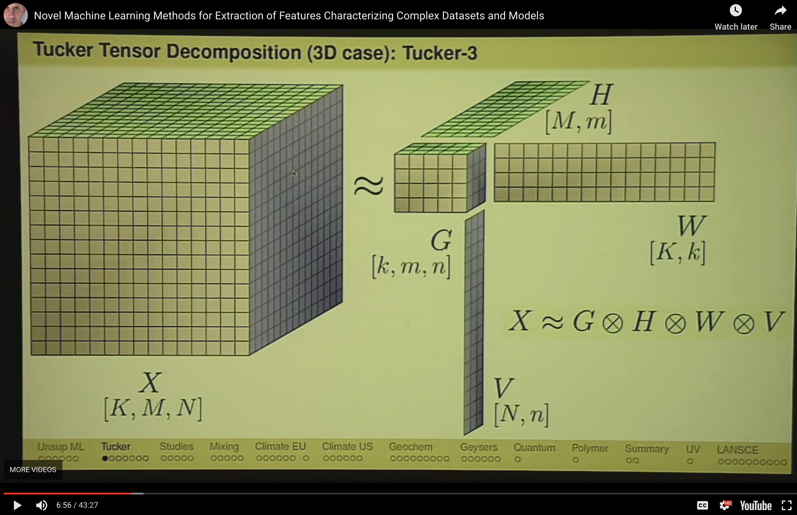

NTFk: Nonnegative Tensor Factorization using k-means clustering
================

<div style="text-align: left">
    
</div>

**NTFk** performs a novel unsupervised Machine Learning (ML) method based on Tensor Decomposition coupled with sparsity and nonnegativity constraints.
**NTFk** methodology allows for automatic identification of the optimal number of features (signals) present in multi-dimensional data arrays (tensors).
The number of features (tensor "rank") along different dimensions can be estimated jointly and independently.

**NMFk** can be applied to perform various types of analyses of multi-dimensional data:

- Feature extraction (**FE**)
- Blind source separation (**BSS**)
- Detection of disruptions / anomalies
- Image recognition
- Separation of (physics) processes
- Discovery of unknown dependencies and phenomena
- Development reduced-order/surrogate models
- Identification of dependencies between model inputs and outputs
- Guiding development of physics models representing the ML analyzed data
- Data classification
- Blind predictions
- Optimization of data acquisition (optimal experimental design)
- Labeling of datasets for supervised ML analyses


**NTFk** provides high-performance computing capabilities to solve problems with Shared and Distributed Arrays in parallel.
The parallelization allows for utilization of multi-core / multi-processor environments.
GPU and TPU accelerations are also available through existing Julia packages.

**NTFk** can be employed to perform tensor decomposition using CP (Candecomp/Parafac) and Tucker methods.

**NTFk** provides options to access to tensor decomposition methods available in MATLAB modules (MATLAB installation required): Tamara Kolda's [TensorToolbox](https://www.tensortoolbox.org), Ivan Oseledets' [TT-Toolbox](https://www.mathworks.com/matlabcentral/fileexchange/46312-oseledets-tt-toolbox), Wotao Yin's [BCU](https://www.math.ucla.edu/~wotaoyin/papers/bcu/matlab.html), and [TensorLab](https://www.tensorlab.net).

**NTFk** provides also interface to Jean Kossaifi's [Python TensorLy](http://tensorly.org/stable/index.html).

**NTFk** can perform high-performance computing tensor decomposition analyses using TensorFlow, PyTorch and MXNET.

**NTFk** methodology and applications are discussed in the the papers and presentations listed below.

Tensor network decompositions can be be performed using our [**NTNk**](https://github.com/TensorDecompositions/NTNk.jl) package.

### Installation

After starting Julia, execute:

```julia
import Pkg; Pkg.add("NTFk")
```

to access the latest released version.
To utilize the latest updates (commits) use:

```julia
import Pkg; Pkg.develop("NTFk")
```

Docker
-------

```bash
docker run --interactive --tty montyvesselinov/tensors
```

The docker image provides access to all **TensorDecomposition** packages.

### Testing

```julia
Pkg.test("NTFk")
```

### Tensor Decomposition

**NTFk** performs a novel unsupervised Machine Learning (ML) method based on Tensor Decomposition coupled with sparsity and nonnegativity constraints.

**NTFk** has been applied to extract the temporal and spatial footprints of the features in multi-dimensional datasets in the form of multi-way arrays or tensors.

**NTFk** executes the decomposition (factorization) of a given tensor  by minimization of the Frobenius norm:


<!-- X-G\otimes_1 A_1\otimes_2A_2\dots\otimes_nA_n_F^2 -->

where:

*  is the dimensionality of the tensor 
*  is a "mixing" core tensor
*  are "feature” factors (in the form of vectors or matrices)
*  is a tensor product applied to fold-in factors   in each of the tensor dimensions

<div style="text-align: center">
    
</div>

The product  is an estimate of  ().

The reconstruction error  is expected to be random uncorrelated noise.

 is a -dimensional tensor with a size and a rank lower than the size and the rank of .
The size of tensor  defines the number of extracted features (signals) in each of the tensor dimensions.

The factor matrices  represent the extracted features (signals) in each of the tensor dimensions.
The number of matrix columns equals the number of features in the respective tensor dimensions (if there is only 1 column, the particular factor is a vector).
The number of matrix rows in each factor (matrix)  equals the size of tensor X in the respective dimensions.

The elements of tensor  define how the features along each dimension () are mixed to represent the original tensor .

**NTFk** can perform Tensor Decomposition using [Candecomp/Parafac (CP)](https://en.wikipedia.org/wiki/Tensor_rank_decomposition) or [Tucker](https://en.wikipedia.org/wiki/Tucker_decomposition) decomposition models.

Some of the decomposition models can theoretically lead to unique solutions under specific, albeit rarely satisfied, noiseless conditions.
When these conditions are not satisfied, additional minimization constraints can assist the factorization.
A popular approach is to add sparsity and nonnegative constraints.
Sparsity constraints on the elements of G reduce the number of features and their mixing (by having as many zero entries as possible).
Nonnegativity enforces parts-based representation of the original data which also allows the Tensor Decomposition results for  and  to be easily interrelated [Cichocki et al, 2009](https://books.google.com/books?hl=en&lr=&id=KaxssMiWgswC&oi=fnd&pg=PR5&ots=Lta2adM6LV&sig=jNPDxjKlON1U3l46tZAYH92mvAE#v=onepage&q&f=false).

### Examples

A simple problem demonstrating **NTFk** can be executed as follows.
First, generate a random Tucker tensor:

```julia
import NTFk
import TensorDecompositions

csize = (2, 3, 4)
tsize = (5, 10, 15)
tucker_orig = NTFk.rand_tucker(csize, tsize; factors_nonneg=true, core_nonneg=true)
```

After that, we can compose a tensor based on this Tucker decomposition:

```julia
import TensorDecompositions

T_orig = TensorDecompositions.compose(tucker_orig)
T_orig .*= 1000
```

Applying **NTFk**, we can find the unknown core size of the tensor using the tensor by itself as an input only.
To do this, we explore a series of core sizes and we identify the optimal one:

```julia
sizes = [csize, (1,3,4), (3,3,4), (2,2,4), (2,4,4), (2,3,3), (2,3,5)]
tucker_estimated, csize_estimated = NTFk.analysis(T_orig, sizes, 3; eigmethod=[false,false,false], progressbar=false, tol=1e-16, max_iter=100000, lambda=0.);
```

**NTFk** execution will produce something like this:

```
[ Info: Decompositions (clustering dimension: 1)
1 - (2, 3, 4): residual 5.46581369842339e-5 worst tensor correlations [0.999999907810158, 0.9999997403618763, 0.9999995616299466] rank (2, 3, 4) silhouette 0.9999999999999997
2 - (1, 3, 4): residual 0.035325052042119755 worst tensor correlations [0.9634250567157897, 0.9842244237924007, 0.9254792458530211] rank (1, 3, 3) silhouette 1.0
3 - (3, 3, 4): residual 0.00016980024483822563 worst tensor correlations [0.9999982865486768, 0.9999923375643894, 0.9999915188040427] rank (3, 3, 4) silhouette 0.9404124172744835
4 - (2, 2, 4): residual 0.008914390317042747 worst tensor correlations [0.99782068249921, 0.9954301522732436, 0.9849956624171726] rank (2, 2, 4) silhouette 1.0
5 - (2, 4, 4): residual 0.00016061795564929862 worst tensor correlations [0.9999980289931861, 0.999996821183636, 0.9999940994076768] rank (2, 4, 4) silhouette 0.9996306553034816
6 - (2, 3, 3): residual 0.004136013571334162 worst tensor correlations [0.999947037606024, 0.9989851398124378, 0.9974723120905729] rank (2, 3, 3) silhouette 0.9999999999999999
7 - (2, 3, 5): residual 7.773676978117656e-5 worst tensor correlations [0.9999997131266367, 0.999999385995213, 0.9999988336042696] rank (2, 3, 5) silhouette 0.9999359399113312
[ Info: Estimated true core size based on the reconstruction: (2, 3, 4)
```

The final **NTFk** result is the estimated core size `(2,3,4)` which as expected matches the original unknown core size.

**NTFk** also produces a Tucker deconstruction of this tensor with core size `(2,3,4)` which is stored as `tucker_estimated[ibest]`

### Notebooks:

A series of Jupyter notebooks demonstrating **NMFk** have been developed:

- [Simple Tucker tensor decomposition](https://github.com/TensorDecompositions/NTFk.jl/blob/master/notebooks/simple_tensor_decomposition.ipynb)
- [Simple Candecomp/Parafac (CP) tensor decomposition](https://github.com/TensorDecompositions/NTFk.jl/blob/master/notebooks/simple_tensor_decomposition_cp.ipynb)

### Applications:

**NTFk** has been applied in a wide range of real-world applications.
The analyzed datasets include model outputs, laboratory experimental data, and field tests:

- Climate modeling
- Material characterization using X rays
- Reactive mixing
- Molecular dynamics
- Contaminant transport
- Induced seismicity
- Phase separation of co-polymers
- Oil / Gas extraction from unconventional reservoirs

### Videos:

(click on the images below to start the videos)

- Europe Climate Model: Water table fluctuations in 2003
<div style="text-align: left">
    <a href="https://www.youtube.com/embed/18EHkbDt5-0"></a>
</div>

- Europe Climate Model: Deconstruction of water table fluctuations in 2003
<div style="text-align: left">
    <a href="https://www.youtube.com/embed/s8socihoqTo"></a>
</div>

- Europe Climate Model: Air temperature fluctuations in 2003
<div style="text-align: left">
    <a href="https://www.youtube.com/embed/ZAWBn3OsCCw"></a>
</div>

- Europe Climate Model: Deconstruction of Air temperature fluctuations in 2003
<div style="text-align: left">
    <a href="https://www.youtube.com/embed/qUQvChqE8_4"></a>
</div>

- Oklahoma seismic events
<div style="text-align: left">
    <a href="https://www.youtube.com/embed/prP_OZFA3tE"></a>
</div>

- Deconstruction of Oklahoma seismic events
<div style="text-align: left">
    <a href="https://www.youtube.com/embed/xIoWi0WjeoQ"></a>
</div>

- Deconstruction of Oklahoma seismic events
<div style="text-align: left">
    <a href="https://www.youtube.com/embed/xIoWi0WjeoQ"></a>
</div>

Videos are available on [YouTube](https://www.youtube.com/watch?v=xPOkeLMJywE&list=PLpVcrIWNlP22LfyIu5MSZ7WHp7q0MNjsj)

### Publications:

- Vesselinov, V.V., Mudunuru, M., Karra, S., O'Malley, D., Alexandrov, B.S., Unsupervised Machine Learning Based on Non-Negative Tensor Factorization for Analyzing Reactive-Mixing, Journal of Computational Physics, 2018 (in review). [PDF](http://monty.gitlab.io/papers/Vesselinov%20et%20al%202018%20Unsupervised%20Machine%20Learning%20Based%20on%20Non-Negative%20Tensor%20Factorization%20for%20Analyzing%20Reactive-Mixing.pdf)
- Vesselinov, V.V., Alexandrov, B.S., O'Malley, D., Nonnegative Tensor Factorization for Contaminant Source Identification, Journal of Contaminant Hydrology, 10.1016/j.jconhyd.2018.11.010, 2018. [PDF](http://monty.gitlab.io/papers/Vesselinov%20et%20al%202018%20Nonnegative%20Tensor%20Factorization%20for%20Contaminant%20Source%20Identification.pdf)

Research papers are also available at [Google Scholar](http://scholar.google.com/citations?user=sIFHVvwAAAAJ&hl=en), [ResearchGate](https://www.researchgate.net/profile/Velimir_Vesselinov) and [Academia.edu](https://lanl.academia.edu/monty)

### Presentations:

- Vesselinov, V.V., Novel Machine Learning Methods for Extraction of Features Characterizing Datasets and Models, AGU Fall meeting, Washington D.C., 2018. [PDF](http://monty.gitlab.io/presentations/Vesselinov%202018%20Novel%20Machine%20Learning%20Methods%20for%20Extraction%20of%20Features%20Characterizing%20Datasets%20and%20Models%20LA-UR-18-31366.pdf)
- Vesselinov, V.V., Novel Machine Learning Methods for Extraction of Features Characterizing Complex Datasets and Models, Recent Advances in Machine Learning and Computational Methods for Geoscience, Institute for Mathematics and its Applications, University of Minnesota, 2018. [PDF](http://monty.gitlab.io/presentations/Vesselinov%202018%20Novel%20Machine%20Learning%20Methods%20for%20Extraction%20of%20Features%20Characterizing%20Complex%20Datasets%20and%20Models%20LA-UR-18-30987.pdf)

Presentations are also available at [slideshare.net](https://www.slideshare.net/VelimirmontyVesselin), [ResearchGate](https://www.researchgate.net/profile/Velimir_Vesselinov) and [Academia.edu](https://lanl.academia.edu/monty)

### Lectures:

- [Vesselinov, V.V., Novel Machine Learning Methods for Extraction of Features Characterizing Complex Datasets and Models, Recent Advances in Machine Learning and Computational Methods for Geoscience, Institute for Mathematics and its Applications, University of Minnesota, 2018.](https://youtu.be/xPOkeLMJywE)

[](https://www.youtube.com/embed/xPOkeLMJywE)

### Extra information

For more information, visit [monty.gitlab.io](http://monty.gitlab.io), [tensordecompositions.github.io],(https://tensordecompositions.github.io), and [tensors.lanl.gov](http://tensors.lanl.gov)

Installation behind a firewall
------------------------------

Julia uses git for package management. Add in the `.gitconfig` file in your home directory:

```
[url "https://"]
        insteadOf = git://
```

or execute:

```
git config --global url."https://".insteadOf git://
```

Set proxies:

```
export ftp_proxy=http://proxyout.<your_site>:8080
export rsync_proxy=http://proxyout.<your_site>:8080
export http_proxy=http://proxyout.<your_site>:8080
export https_proxy=http://proxyout.<your_site>:8080
export no_proxy=.<your_site>
```

For example, if you are doing this at LANL, you will need to execute the
following lines in your bash command-line environment:

```
export ftp_proxy=http://proxyout.lanl.gov:8080
export rsync_proxy=http://proxyout.lanl.gov:8080
export http_proxy=http://proxyout.lanl.gov:8080
export https_proxy=http://proxyout.lanl.gov:8080
export no_proxy=.lanl.gov
```
