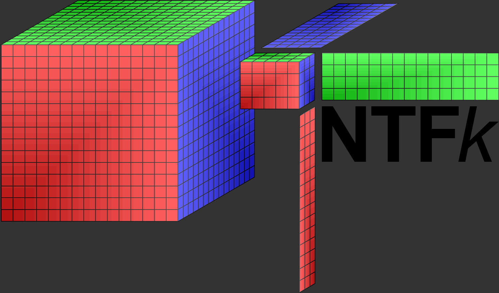
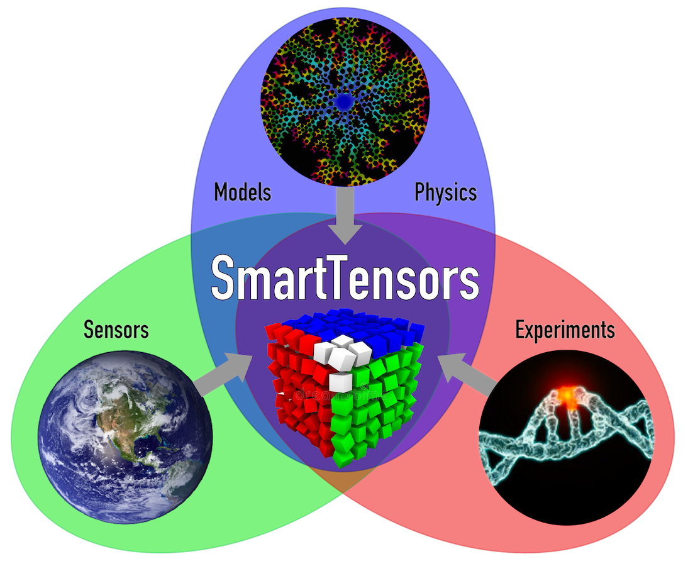
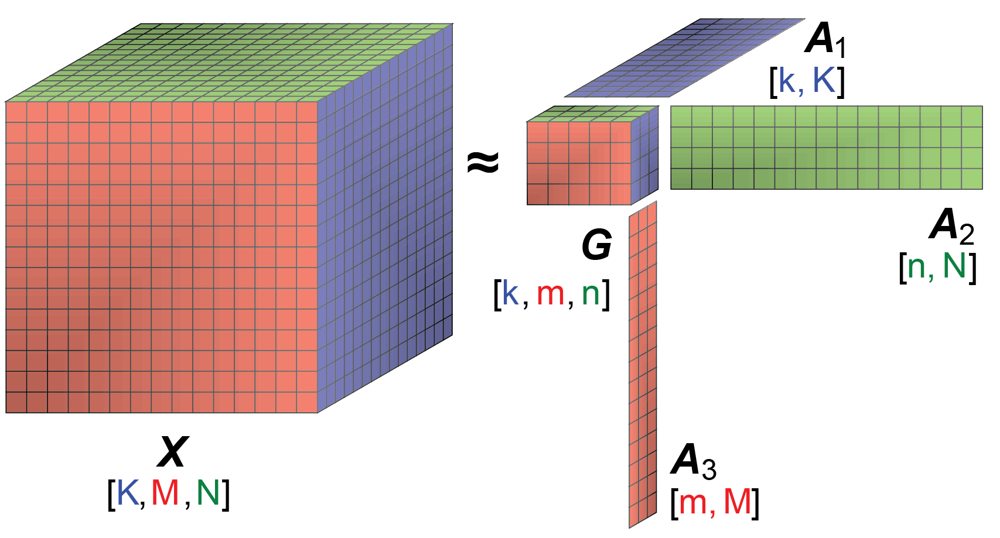
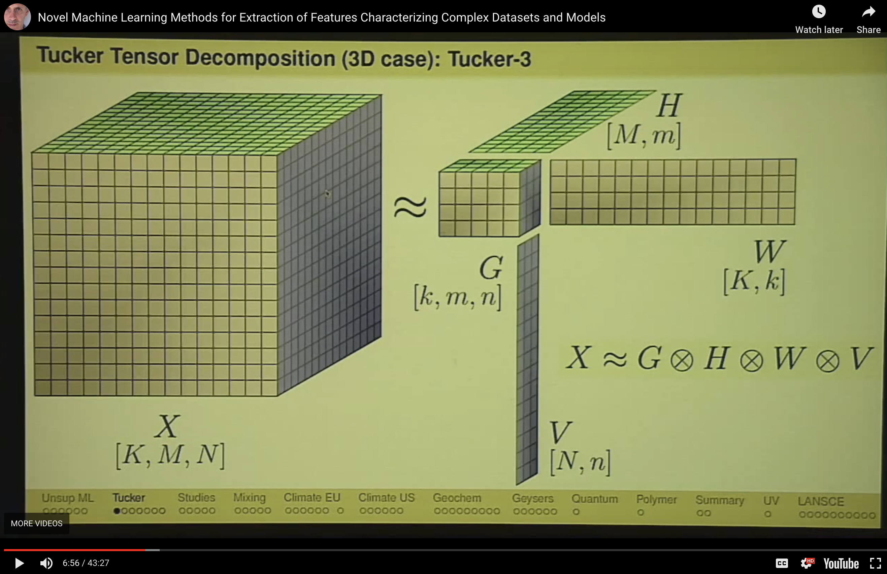

# NTFk.jl: Nonnegative Tensor Factorization with Rank Estimation

<div align="left">
    
</div>

**NTFk.jl** is a Julia package for extracting latent structure from multidimensional
data. It combines nonnegative tensor factorization, optional sparsity and
physics-informed constraints, repeated decompositions, and k-means clustering to
estimate both the latent factors and their number.

NTFk is part of the [SmartTensors](https://smarttensors.com) machine-learning
framework. For matrix factorization, see [NMFk.jl](https://github.com/SmartTensors/NMFk.jl);
for tensor-network decomposition, see [NTNk.jl](https://github.com/SmartTensors/NTNk.jl).

## Why NTFk?

Tensor rank is usually unknown, and a single factorization can be sensitive to
initialization. NTFk explores candidate ranks, compares repeated solutions, and
uses reconstruction quality and clustering stability to identify robust latent
features. For Tucker models, it can estimate a separate rank along each tensor
dimension.

NTFk supports CP (CANDECOMP/PARAFAC) and Tucker decomposition models and can be
used for:

- Feature extraction and blind source separation
- Anomaly and disruption detection
- Image recognition
- Text mining
- Data classification
- Separation of co-occurring physical processes
- Reduced-order and surrogate modeling
- Discovery of dependencies between model inputs and outputs
- Prediction, experimental design, and dataset labeling

Parallel execution can use Julia shared and distributed arrays on multicore and
multiprocessor systems. NTFk can also connect to decomposition implementations in
[TensorLy](http://tensorly.org/stable/index.html) and, when MATLAB is installed,
[Tensor Toolbox](https://www.tensortoolbox.org),
[TT-Toolbox](https://www.mathworks.com/matlabcentral/fileexchange/46312-oseledets-tt-toolbox),
[BCU](https://www.math.ucla.edu/~wotaoyin/papers/bcu/matlab.html), and
[Tensorlab](https://www.tensorlab.net).

<div align="left">
    
</div>

## Awards

SmartTensors and NTFk received two 2021 R&D 100 honors:

- R&D 100 Award: [Information Technologies](https://www.rdworldonline.com/2021-rd-100-award-winners-announced-in-analytical-test-and-it-electrical-categories)
- R&D 100 Bronze Medal: [Market Disruptor in Services](https://www.rdworldonline.com/2021-rd-100-special-recognition-winners-announced)

<div align="left">
    
</div>

## Installation

Install the latest release from the Julia package registry:

```julia
import Pkg
Pkg.add("NTFk")
```

To install the latest development version from the `master` branch:

```julia
import Pkg
Pkg.add(Pkg.PackageSpec(name="NTFk", rev="master"))
```

## Docker

```bash
docker run --interactive --tty montyvesselinov/tensors
```

The Docker image includes the SmartTensors packages. See the
[SmartTensors documentation](https://smarttensors.github.io) for details.

## Testing

```julia
import Pkg
Pkg.test("NTFk")
```

## Tensor decomposition

NTFk decomposes a data tensor into a compact set of interpretable factors. It
supports sparsity, nonnegativity, and problem-specific physical or mathematical
constraints.

For a Tucker model, NTFk approximates an $n$-dimensional tensor $X$ by minimizing
the squared Frobenius reconstruction error:

$$
\frac{1}{2}\left\|X-G\times_1 A_1\times_2 A_2\cdots\times_n A_n\right\|_F^2.
$$

Here:

- $n$ is the number of dimensions (modes) in $X$.
- $G$ is the core tensor that describes how the features interact.
- $A_1,A_2,\ldots,A_n$ are factor matrices whose columns represent the features
  along each mode.
- $\times_i$ is the mode-$i$ tensor-matrix product.

<div align="center">
    
</div>

The product $G\times_1A_1\times_2A_2\cdots\times_nA_n$ is the reconstructed
tensor $X_{\mathrm{est}}$. Ideally, the residual $X-X_{\mathrm{est}}$ contains
only uncorrelated noise.

The size of $G$ determines how many features are extracted along each mode. Each
factor matrix $A_i$ has one row for every entry along mode $i$ of $X$ and one
column for every extracted feature along that mode. The elements of $G$ describe
how those features combine to reconstruct $X$.

NTFk supports [CANDECOMP/PARAFAC (CP)](https://en.wikipedia.org/wiki/Tensor_rank_decomposition)
and [Tucker](https://en.wikipedia.org/wiki/Tucker_decomposition) models. Because
tensor decompositions are not always unique, constraints can make their solutions
more stable and interpretable. Sparsity limits the number of active features and
their interactions; nonnegativity produces a parts-based representation in which
$G$ and $A_1,A_2,\ldots,A_n$ are easier to relate to the original data
([Cichocki et al., 2009](https://books.google.com/books?id=KaxssMiWgswC&pg=PR5)).

## Examples

This example generates a random Tucker tensor and asks NTFk to recover its
unknown core size:

```julia
import NTFk
import TensorDecompositions

csize::NTuple{3, Int} = (2, 3, 4)
tsize::NTuple{3, Int} = (5, 10, 15)
tucker_orig::TensorDecompositions.Tucker{Float64, 3} =
    NTFk.rand_tucker(csize, tsize; factors_nonneg=true, core_nonneg=true)
```

Compose the full tensor represented by the Tucker model:

```julia
T_orig::Array{Float64, 3} = TensorDecompositions.compose(tucker_orig)
T_orig .*= 1000
```

Explore several candidate core sizes. NTFk runs three factorizations for each
candidate and selects the best-supported model:

```julia
sizes::Vector{NTuple{3, Int}} =
    [csize, (1, 3, 4), (3, 3, 4), (2, 2, 4), (2, 4, 4), (2, 3, 3), (2, 3, 5)]

analysis_result::Tuple{
    Vector{TensorDecompositions.Tucker{Float64, 3}},
    NTuple{3, Int},
    Int,
} = NTFk.analysis(
    T_orig,
    sizes,
    3;
    eigmethod=[false, false, false],
    progressbar=false,
    tol=1e-16,
    maxiter=100_000,
    lambda=0.0,
)

tucker_estimated::Vector{TensorDecompositions.Tucker{Float64, 3}} = analysis_result[1]
csize_estimated::NTuple{3, Int} = analysis_result[2]
ibest::Int = analysis_result[3]
```

**NTFk** execution will produce something like this:

```
[ Info: Decompositions (clustering dimension: 1)
1 - (2, 3, 4): residual 5.46581369842339e-5 worst tensor correlations [0.999999907810158, 0.9999997403618763, 0.9999995616299466] rank (2, 3, 4) silhouette 0.9999999999999997
2 - (1, 3, 4): residual 0.035325052042119755 worst tensor correlations [0.9634250567157897, 0.9842244237924007, 0.9254792458530211] rank (1, 3, 3) silhouette 1.0
3 - (3, 3, 4): residual 0.00016980024483822563 worst tensor correlations [0.9999982865486768, 0.9999923375643894, 0.9999915188040427] rank (3, 3, 4) silhouette 0.9404124172744835
4 - (2, 2, 4): residual 0.008914390317042747 worst tensor correlations [0.99782068249921, 0.9954301522732436, 0.9849956624171726] rank (2, 2, 4) silhouette 1.0
5 - (2, 4, 4): residual 0.00016061795564929862 worst tensor correlations [0.9999980289931861, 0.999996821183636, 0.9999940994076768] rank (2, 4, 4) silhouette 0.9996306553034816
6 - (2, 3, 3): residual 0.004136013571334162 worst tensor correlations [0.999947037606024, 0.9989851398124378, 0.9974723120905729] rank (2, 3, 3) silhouette 0.9999999999999999
7 - (2, 3, 5): residual 7.773676978117656e-5 worst tensor correlations [0.9999997131266367, 0.999999385995213, 0.9999988336042696] rank (2, 3, 5) silhouette 0.9999359399113312
[ Info: Estimated true core size based on the reconstruction: (2, 3, 4)
```

The estimated core size is `(2, 3, 4)`, matching the core size used to generate
the synthetic tensor.

The selected Tucker decomposition is available as `tucker_estimated[ibest]`.

## Notebook

A [Jupyter notebook](notebooks/simple_tensor_decomposition.ipynb) demonstrates a
simple Tucker tensor decomposition.

The notebook can also be opened using:

```julia
NTFk.notebooks()
```

## Applications

NTFk has been applied to model outputs, laboratory experiments, and field data
in areas including:

- Climate data and simulations
- Watershed data and simulations
- Aquifer simulations
- Surface-water and groundwater analysis
- Material characterization
- Reactive mixing
- Molecular dynamics
- Contaminant transport
- Induced seismicity
- Phase separation of co-polymers
- Oil and gas extraction from unconventional reservoirs
- Geothermal exploration and production
- Geologic carbon storage
- Wildfires

## Videos

- Europe Climate Model: Water table fluctuations in 2003
<div align="left">
    <a href="https://www.youtube.com/watch?v=18EHkbDt5-0"></a>
</div>

- Europe Climate Model: Deconstruction of water table fluctuations in 2003
<div align="left">
    <a href="https://www.youtube.com/watch?v=s8socihoqTo"></a>
</div>

- Europe Climate Model: Air temperature fluctuations in 2003
<div align="left">
    <a href="https://www.youtube.com/watch?v=ZAWBn3OsCCw"></a>
</div>

- Europe Climate Model: Deconstruction of Air temperature fluctuations in 2003
<div align="left">
    <a href="https://www.youtube.com/watch?v=qUQvChqE8_4"></a>
</div>

- Oklahoma seismic events
<div align="left">
    <a href="https://www.youtube.com/watch?v=prP_OZFA3tE"></a>
</div>

- Deconstruction of Oklahoma seismic events
<div align="left">
    <a href="https://www.youtube.com/watch?v=xIoWi0WjeoQ"></a>
</div>

More videos are available in the
[SmartTensors YouTube playlist](https://www.youtube.com/playlist?list=PLpVcrIWNlP22LfyIu5MSZ7WHp7q0MNjsj).

## Publications

- Vesselinov, V.V., Mudunuru, M., Karra, S., O'Malley, D., Alexandrov, B.S., Unsupervised Machine Learning Based on Non-Negative Tensor Factorization for Analyzing Reactive-Mixing, Journal of Computational Physics, 2018 (in review). [PDF](http://monty.gitlab.io/papers/Vesselinov%20et%20al%202018%20Unsupervised%20Machine%20Learning%20Based%20on%20Non-Negative%20Tensor%20Factorization%20for%20Analyzing%20Reactive-Mixing.pdf)
- Vesselinov, V.V., Alexandrov, B.S., O'Malley, D., Nonnegative Tensor Factorization for Contaminant Source Identification, Journal of Contaminant Hydrology, 10.1016/j.jconhyd.2018.11.010, 2018. [PDF](http://monty.gitlab.io/papers/Vesselinov%20et%20al%202018%20Nonnegative%20Tensor%20Factorization%20for%20Contaminant%20Source%20Identification.pdf)

Research papers are also available at [Google Scholar](http://scholar.google.com/citations?user=sIFHVvwAAAAJ&hl=en), [ResearchGate](https://www.researchgate.net/profile/Velimir_Vesselinov) and [Academia.edu](https://lanl.academia.edu/monty)

## Presentations

- Vesselinov, V.V., Novel Machine Learning Methods for Extraction of Features Characterizing Datasets and Models, AGU Fall meeting, Washington D.C., 2018. [PDF](http://monty.gitlab.io/presentations/Vesselinov%202018%20Novel%20Machine%20Learning%20Methods%20for%20Extraction%20of%20Features%20Characterizing%20Datasets%20and%20Models%20LA-UR-18-31366.pdf)
- Vesselinov, V.V., Novel Machine Learning Methods for Extraction of Features Characterizing Complex Datasets and Models, Recent Advances in Machine Learning and Computational Methods for Geoscience, Institute for Mathematics and its Applications, University of Minnesota, 2018. [PDF](http://monty.gitlab.io/presentations/Vesselinov%202018%20Novel%20Machine%20Learning%20Methods%20for%20Extraction%20of%20Features%20Characterizing%20Complex%20Datasets%20and%20Models%20LA-UR-18-30987.pdf)

Presentations are also available at [slideshare.net](https://www.slideshare.net/VelimirmontyVesselin), [ResearchGate](https://www.researchgate.net/profile/Velimir_Vesselinov) and [Academia.edu](https://lanl.academia.edu/monty)

## Lectures

- [Vesselinov, V.V., Novel Machine Learning Methods for Extraction of Features Characterizing Complex Datasets and Models, Recent Advances in Machine Learning and Computational Methods for Geoscience, Institute for Mathematics and its Applications, University of Minnesota, 2018.](https://youtu.be/xPOkeLMJywE)

[](https://www.youtube.com/watch?v=xPOkeLMJywE)

## Extra information

For more information, visit [SmartTensors](https://smarttensors.com), the
[SmartTensors documentation](https://smarttensors.github.io), or
[monty.gitlab.io](https://monty.gitlab.io).
